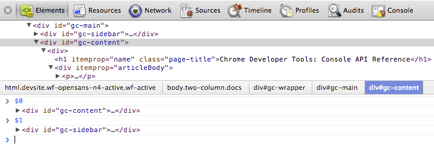

## 命令行 API 参考

命令行是 Chrome Devtools 中一个执行常见任务的函数集。这些函数提供一些方便的功能来选择和检查 DOM 元素、启动和停止分析器和检测 DOM 事件。这个 API 是对 console API 的补充，也只能在 console 面板使用。

#### $_

返回最近执行的表达式的值，下面的例子中先对一个简单的表达式求值，然后打印 $_ 属性的值，会包含相同的值：


下面的例子中，用 $$() 方法计算表达式，该方法返回与 CSS 选择器匹配的元素的数组。然后计算 $_.length，获得一个数组长度，即最近执行的表达式值的长度。


#### $0 - $4

Devtools 会记住在该选项卡（或 Profiles 面板）选择的五个 DOM 元素（或 JavaScript 对象）。这些对象可以使用 $0,$1,$2,$3,$4 来访问，$0 返回最近选择的元素或 JavaScript 对象，$1 返回倒数第二个选择的对象或元素，以此类推。

下面的例子中，Elements 面板中 ID 为 gc-sidebar 的元素被选择，Console 面板中调用 $0，打印出了相同的元素。


下图中，同一个页面中的 gc-content 被选择，现在 $0 指向的就是最新选择的元素，$1 指向的是之前选择的元素（gc-sidebar）。



#### $(selector)

返回匹配参数中 CSS 选择器的第一个元素，是 document.querySelector() 方法的别名。

下面的示例中，保存了文档中第一个 `` 元素，然后调用其 src 属性并显示出来。

```js
$('img').src;
```


#### $$(selector)

返回匹配参数中 CSS 选择器的所有元素，是 document.querySelctorAll() 的别名。

下面的例子中使用 $$() 创建了一个包含页面中所有 `` 元素的数组，然后通过遍历来展示其中每个元素的 src 属性。

```js
var images = $$('img');
for (each in images) {
    images[each].src;
}
```


> 提示：在 console 面板中使用 Shift + Enter 可以为代码换行。

#### $x(path)

返回匹配所给参数中 Xpath 表达式的所有元素，是一个数组，下面的示例中，选择了所有包含 `<a>` 元素的 `<p>` 元素。

```js
$x("//p[a]")
```


#### clear()

清除打印历史。

#### copy(object)

把指定对象以字符串形式复制到剪贴板。
```js
copy($0);
```

#### debug(function)

当指定的函数被调用时，调试器也会被调用，也会在控制面板中的指定函数处停止，让你能够但不执行代码，并调试其中的功能。

```js
debug(getData);
```


### dir(object)

以列表形式显示指定对象的所有属性，是 console.dir() 的别名。

下面的例子显示了使用 document.body 和 dir() 来打印同意个元素的区别。

```js
document.body;
dir(document.body);
```


#### dirxml(object)

打印指定对象的 XML 表示，与 Elements 面板的显示效果一致，相当于 console.dirxml()。

#### inspect(object/function)

打开对应的面板并选择指定的元素或对象：DOM 元素则打开 Elements 面板，JavaScript 堆对象则打开 Profiles 面板。

下面的示例打开了 document.body 的第一个子元素：

```js
inspect(document.body.firstChild);
```


如果参数是一个函数，则会打 Sources 面板并跳转至此函数的位置来让你进行调试。

#### getEventListeners(object)

返回指定对象所注册的事件监听器。返回值是一个包含所有绑定的监听事件类型（如：click,keydown）的对象，对象中的每个成员都是一个事件类型监听器的对象，下面的例子列出了 document 对象上绑定的事件监听器。

```js
getEventListeners(document);
```


如果一个对象上绑定了不止一个监听器，那么数组会包含一个代表监听器个数的数字。例如，下面的例子中 #scrollingList 元素上，为 mousedown 事件绑定了两个事件监听：


可以展开每个对象来查看其中的属性：


#### keys(object)

返回指定对象的属性名，可以使用 values() 来获取每个属性名对应的属性值。

例如，假设你的应用里定义了下面的对象：

```js
var player1 = {
    "name": "Ted",
    "level": 42
}
```

假设 player1 是在全局环境下声明，使用 keys() 和 values() 将会在控制台输出如下内容：


#### monitor(function)

当指定的函数被调用时，会在控制台输出一条消息，此消息包含函数名以及被调用时传入的参数。

```js
function sum(x, y) {
    return x + y;
}
monitor(sum);
```


#### monitorEvents(object[, events])

当指定对象的指定事件被触发时，Event 对象会被在控制台输出。你可以指定监听单个事件、事件数组或已定义事件中的一个事件类型。参见下面的例子：

下面的示例监听了 window 对象上所有的 resize 事件。

```js
monitorEvents(window, "resize");
```


下面的示例定义了数组来监听 window 对象上的 resize 和 scroll 事件：

```js
monitorEvents(window, ["resize", "scroll"])
```

你也可以指定事件类型，只需要传入事件类型的字符串格式即可，下面列出了可用事件类型及其相关的事件：

- mouse："click", "dblclick", "mousedown", "mouseeenter", "mouseleave", "mousemove", "mouseout", "mouseover", "mouseup", "mouseleave", "mousewheel"
- key："keydown", "keyup", "keypress", "textInput"
- touch："touchstart", "touchmove", "touchend", "touchcancel"
- control："resize", "scroll", "zoom", "focus", "blur", "select", "change", "submit", "reset"

例如，为 #msg 表单绑定了所有的 "key" 事件类型。

```js
monitorEvents($("#msg"), "key");
```

下面显示的是在表单输入两个字符之后的控制台：


#### profile([name])

启动一个  JavaScript CPU 分析会话，参数是会话名称，调用 profileEnd() 表示完成会话。

开始分析：

```js
profile("My profile")
```

停止分析并在 Profiles 面板打印分析结果：

```js
profileEnd("My profile")
```

分析也可以嵌套，而且没有顺序要求：

```js
profile('A');
profile('B');
profileEnd('A');
profileEnd('B');
```

#### profileEnd([name])

停止使用 profile() 开始的当前分析，在 Profiles 面板打印分析结果。

#### table(data[, columns])

传入一个数据对象作为参数，以表格的形式打印出来，可选参数为列标题。例如，在控制台表格的形式显示一个名单可以这样做：

```js
var names = {
    0: { firstName: "John", lastName: "Smith" },
    1: { firstName: "Jane", lastName: "Doe" }
};
table(names);
```


#### undebug(function)

停止指定函数的调试，这样，当函数调用时，不会再触发调试器。

```js
undebug(getData);
```

#### unmonitor(function)

取消对指定函数的监听，与 monitor() 配合使用。

```js
unmonitor(getData);
```

#### unmonitorEvents(object[, events])

停止监听指定的对象和事件，比如，下面的例子停止了对 window 对象的所有事件的监听:

```js
unmonitorEvents(window);
```

你也可以选择性地停止对一个对象的指定事件的监听。如下，先为当前元素绑定了 mouse 类型的事件监听，然后取消对 mousemove 事件的监听。

```js
monitorEvents($0, "mouse");
unmonitorEvents($0, "mousemove");
```

#### values(object)

返回传入对象的所有属性的值。

```js
values(object);
```

#### 其他 API

Chrome 扩展可以注入其他的辅助方法到命令行 API，例如 [Debug Utils](https://chrome.google.com/webstore/detail/debug-utils/djailkkojeahmihdpcelmmobkpepmkcl) ([github](https://github.com/amasad/debug_utils))。