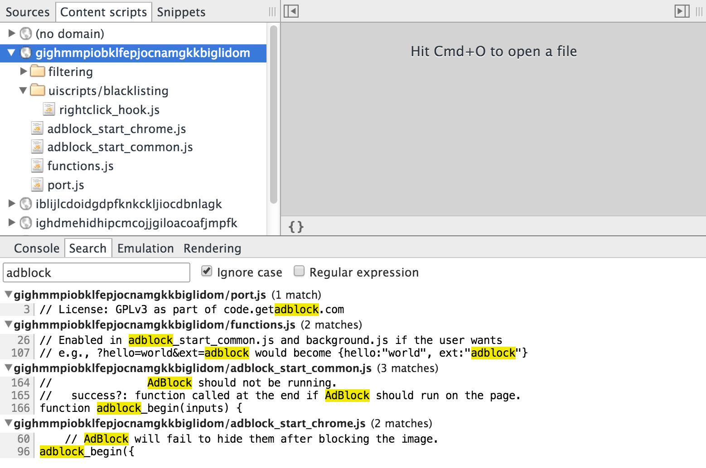
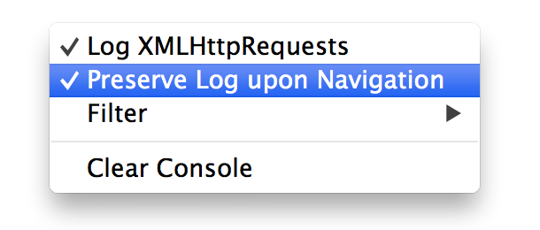

## 设置

<strong>在 Devtools 中更改设置：</strong>

- 点击设置按钮 来打开 General 设置面板进行设置，或者你也可以使用快捷键 `?` 来打开设置面板。

## General

<strong>Disable cache</strong>

禁止资源缓存只对在 Devtools 窗口打开的情况下加载的页面有效，如果 Devtools 关闭则不会禁用缓存。

<strong>Disable JavaScript</strong>

勾选这个选项之后，会立即暂停 Devtools 实例中运行的所有 JavaScript 。

> 注意：Disable cache 和 Disable JavaScript 的设置只在 Devtools 打开时有效，当 Devtools 是打开时，对所有打开 Devtools 窗口的页面都有效。

<strong>Enable Ctrl + 1-9 shortcut to switch panels</strong>

当 Chrome 中有多个网页打开时，你可以使用 `Ctrl` + `1~9` 快捷键来选择跳转到第 1~8 个标签页，9 是跳转到排在最后的标签页。这项设置会在所有 Devtools 中生效。

> 注意：此项设置可能会和其它应用中的快捷键冲突。

#### Appearance 栏

<strong>Split panels vertically when docked to right</strong>

勾选此项后，当面板在屏幕右侧显示时将会更改面板的布局，主要部分会在顶部显示。在小屏幕显示时，如果没有足够的空间让它们并排显示，这项设置能起到很好的帮助作用。

#### Elements 栏

<strong>Color format</strong>

- As authored - (样式中定义的颜色)
- HEX: #DAC0DE
- RGB: rgb(128, 255, 255)
- HSL: hsl(300, 80%, 90%)

Color format 可以设置 Elements 面板中 Styles 侧边栏里的颜色代码显示的格式，你可以点击颜色代码前面的小色块图标来更改颜色代码格式。

选择 As authored 代表浏览器不对颜色代码进行格式化转化，直接按照样式文件中的代码显示。

<strong>Show user agent styles</strong>

在 Elements 面板的 Styles 侧边栏中，你可能经常会看到 user agent styles。

user agent 直接指向浏览器。每个浏览器都有自己默认的样式，由基本样式规则组成，与页面中的 DOM 元素绑定。比如，你有可能曾经在移除两个元素间距时遇到难题，它可能就是 user agent stylesheet 造成的，user agent stylesheet 会给一些元素添加默认的 padding 和 margin。

<strong>Word wrap</strong>

与很多编辑器一样，可以用来设置 Eelement 面板中一长段代码的换行。

<strong>Show Shadow DOM</strong>

有了 [Shadow DOM](http://www.html5rocks.com/zh/tutorials/webcomponents/shadowdom/)，元素就可以和一个新类型的节点关联。这个新类型的节点称为 shadow root。与一个 shadow root 关联的元素称作一个 shadow host。shadow host 的内容不会渲染；shadow root 的内容会渲染。

- [Shadow DOM 201](http://www.html5rocks.com/zh/tutorials/webcomponents/shadowdom/)
- [Shadow DOM 301](http://www.html5rocks.com/en/tutorials/webcomponents/shadowdom-301/)
- [Shadow DOM Polyfill](https://www.polymer-project.org/0.5/platform/shadow-dom.html)
- [Visualizing Shadow DOM Concepts](https://developers.google.com/web/updates/2013/03/Visualizing-Shadow-DOM-Concepts)
- [Define presentational boxes using shadow DOM](http://blogs.adobe.com/webplatform/2013/04/03/defining-presentational-boxes-with-shadow-dom/)

<strong>Show rulers</strong>

勾选此选项之后，在视图的上、左/下会出现一个标尺。

#### Sources 栏

<strong>Search in content scripts</strong>

[Content scripts](https://developer.chrome.com/extensions/content_scripts)属于运行在网页上下文中的 Chrome 扩展的一部分，但是是与普通页面上的 JavaScript 是完全分离的。比如，content scripts 和 page script 不能使用一般的方式进行交互。

当在 Sources 面板中查看 Content scripts 栏时，你可以看到扩展插件的 JS 文件（或被编译进 Chrome 扩展里面的 [User Script](http://www.chromium.org/developers/design-documents/user-scripts)）和被内置在浏览器中的一部分内容脚本，特别是扩展能够使用的一些 API。

> 提示：在开发 Chrome Apps 或扩展时，启用此项设置可以在这些原生 API 中进行搜索，除此之外，启用此项设置没有什么作用。

<strong>Enable JS source maps</strong>

如果你的代码是通过拼接和压缩之后的文件，那么在调试的时候很难去找到一个代码片段具体在哪个文件中。开启这个设置对 `debugging JavaScript` 和 [working with Source maps](https://www.youtube.com/watch?v=HijZNR6kc9A#t=1m32s)会有很大的帮助。

<strong>Enable CSS source maps</strong>

为使用编译器生成的 CSS 文件启用 Source Maps（如 sass）。

详情查看[Working with CSS Preprocessors](../Use-Tools/inspect/CSS-Preprocessors.md)

<strong>Auto-reload generated CSS</strong>

只在 Enable CSS source maps 开启时才能使用，用来设置源文件改变时是否重新加载生成的 CSS 文件。

<strong>Default indentation</strong>

指定在 Devtools 中编辑代码时代码的缩进：

- 2 spaces
- 4 spaces
- 8 spaces
- Tab character

<strong>Show whitespace characters</strong>

在 Sources 面板中的空格位置和制表符位置用点来代替。

#### Profiler 栏

<strong>High resolution CPU profiling</strong>

选择此选项之后，可以让你在 Profile 面板中查看 CPU profiles 的时候将表格放大至十分之一毫秒查看更详细的信息。

#### Console 栏

<strong>Log XMLHttpRequests</strong>

在控制台显示 XHR 请求对象，展开此对象可以查看请求的细节。

<strong>Preserve log upon navigation</strong>

在多个网站页面跳转的时候，你可以选择在每个页面载入时不清除控制台日志，这样你就可以在不同的网页浏览输出的历史记录。

> 提示：这两个设置都可以直接在 console 面板右击鼠标来设置

#### Extensions

Open links in: a panel chosen automatically

## Workspace

[Workspace](../Use-Tools/workspaces.md)可以让你在 Sources 面板添加工作文件夹并编辑文件夹中的文件。文件夹可以只有一个项目，也可以有多个项目。

可以在设置面板点击 Workspace 栏，点击 Add folder 添加本地文件夹来编辑（如：项目根目录）。

当你添加了一个文件夹之后，你可以在 Sources 面板查看、编辑、保存修改到本地文件中。所有的更改都会保存到包含文件的本地目录中。

除了添加文件夹之外，你也可以将单个文件映射到本地，利用文件的 url 与本地计算机文件的 path 对应。

