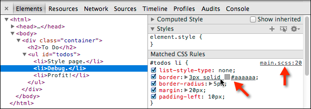
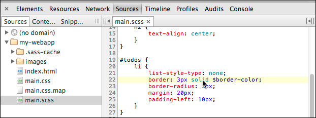

## 使用 CSS 预处理器

很多开发人员使用 CSS 预处理器来生成 CSS 样式表，如 Sass、Less、Stylus，由于是生成的 CSS 文件，所以直接编辑 CSS 文件不是最好的办法。

Devtools 可以在 Source 面板实时编辑预处理器的源文件，而且并不需要刷新页面或离开 Devtools，当你选中一个由生成的 CSS 规定样式的元素时，该元素面板会显示一个链接来打开源文件。



跳转到源文件：

- 点击链接，会跳转到 Source 面板并打开源文件
- Ctrl + 单击（或 Command + 单击）任何属性名或属性值来打开此属性在源文件所在的位置



当你在 Devtools 保存一个更改到 CSS 预处理器文件，CSS 的预处理器会重新生成 CSS 文件，然后 Devtools 重新加载新生成的 CSS 文件。

>在外部编辑器所做的更改 Devtools 不会检测到，除非包含源文件的 Source 栏重新获得焦点。此外，手动编辑一个由 Sass、Less或其他编译器生成的 CSS 文件会破坏 source map ，除非刷新页面。

>如果你使用的是 Workspaces，那么你需要确保所生成的 CSS 文件也映射到 workspace。可以通过查看 Source 面板的右侧树形结构来确定 CSS 文件来源于本地文件夹。

#### 要求

当使用 CSS 预处理器时，下面有几点要求：

- 使用此工作流程，你的 CSS 预处理器必须支持 CCS source map，特别是 Source Map v3 proposal。CSS source map 必须与 CSS 文件一起建立。这样 Devtools 才能把每个 CSS 属性映射到源文件的正确位置（如：Scss 文件）
- 如果需要在更改源文件之后 Devtools 自动重新载入样式，预处理器必须设置为更改源文件时重新生成 CSS 文件。否则，必须手动重新生成 CSS 文件并重新加载页面才能看到更改
- 必须通过一个服务来访问你的站点或 app（不能是 file://URL），而且服务器必须提供 CSS 文件、source maps（.css.map）和源文件（.scss等）的服务
- 如果你不是在使用 workspaces ，那么 web 服务器必须支持 Last-Modified 头，Python 的 SimpleHTTPServer 模块默认就提供这个头信息，你可以在当前目录下使用下面的命令来起一个 web 服务：

```
python -m SimpleHTTPServer
```

#### 启用 CSS source maps

CSS source maps 默认情况下开启，你可以选择启用生成的 CSS 文件自动重新加载。

开启 CSS source maps 和 CSS 重载：

1. 打开 Devtools 设置，点击 General
2. 打开 Enable CSS source maps 和 Auto-reload generated CSSin addition to the compiled CSS

#### Sass 使用的 CSS source maps

要在 Chrome 中实时编辑 Sass ， Sass 版本需要在 3.3 之上，3.3 版本之后增加了对 source map 的支持。

```
gem install sass
```
等到 Sass 安装完成，开启 Sass 编译器并监听 Sass 源文件的变化并为每个生成的 CSS 文件创建 source map ，比如：

```
sass --watch --sourcemap sass/styles.scss:styles.css
```
#### CSS 预处理器支持

Devtools 支持 Source Map Revision 3 proposal ，这条提案正在几个 CSS 预处理器中部署（更新于 2014 年 8 月）：

- Sass：如上面的描述一样，Sass 3.3 支持
- Compass：`--sourcemap`标识在 Compass 1.0 中已经支持，另外，你可以在 config.rb 文件中增加 sourcemap: true，[在这里有演示](https://github.com/grayghostvisuals/sourcemaps)，开发注意事项都在[issue 1108](https://github.com/Compass/compass/issues/1108#issuecomment-52432075)
- Less：在 1.5.0 版本支持，到[issue #1050](https://github.com/less/less.js/issues/1050#issuecomment-25566463)可以查看详情及使用案例
- Autoprefixer：1.0 版本支持，[Autoprefixer文档](https://github.com/postcss/autoprefixer#source-map)说明了如何使用
- Libsass：[实现](https://github.com/sass/libsass/commit/366bc110c39c26c9267a1cc06e578beb94cd93ef)
- Stylus:实现，查看[最新版本](https://github.com/stylus/stylus)

#### CSS source 如何工作

编译器在每次生成 CSS 文件时，除了编写 CSS，都会生成一个 source map 文件（.map文件），source map 是定义每个生成的 CSS 声明与源文件对应的行之间映射的 JSON 文件。每一个 CSS 文件的最后一行都嵌入了一行注释的 URL，指定其 source map 文件：

```css
/*# sourceMappingURL=<url> */
```
举个例子，这里给出一个名为 style.scss 的 SCSS 文件：

```css
$textSize: 26px;
$fontColor: red;
$bgColor: whitesmoke;

h2 {
    font-size: $textSize;
    color: $fontColor;
    background: $bgColor;
}
```
Sass 生成一个 CSS 文件 style.css，包含一个 sourceMappingURL 的注释：

```css
h2 {
  font-size: 26px;
  color: red;
  background-color: whitesmoke;
}
/*# sourceMappingURL=styles.css.map */
```
下面是一个 source map 文件的示例：

```js
{
  "version": "3",
  "mappings":"AAKA,EAAG;EACC,SAAS,EANF,IAAI;EAOX,KAAK"
  "sources": ["sass/styles.scss"],
  "file": "styles.css"
}
```
#### 资源

很多用户已经使用 CSS 预处理器来开发自己的工作流，参阅下面的文章教程可以替代工作流：

- [Getting started with CSS sourcemaps and in-browser Sass editing](https://medium.com/@toolmantim/getting-started-with-css-sourcemaps-and-in-browser-sass-editing-b4daab987fb0)
- [Faster Sass debugging and style iteration with source maps, Chrome Web Developer Tools and Grunt](http://benfrain.com/add-sass-compass-debug-info-for-chrome-web-developer-tools/)

