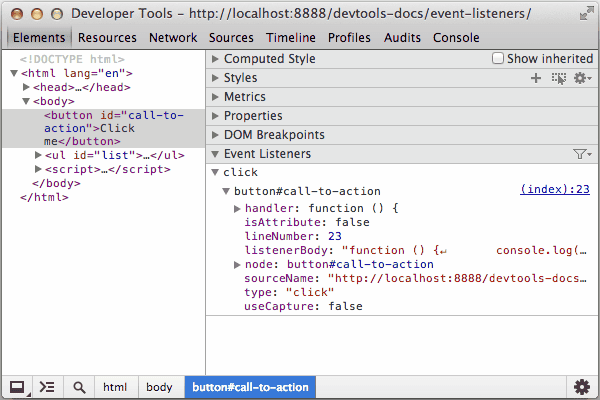
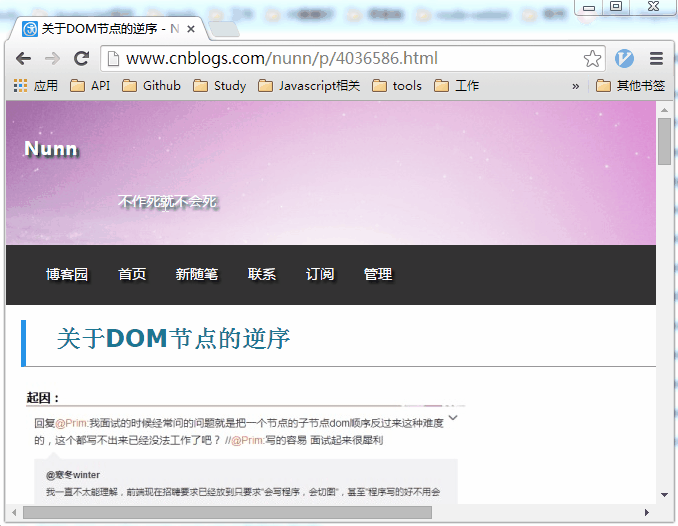
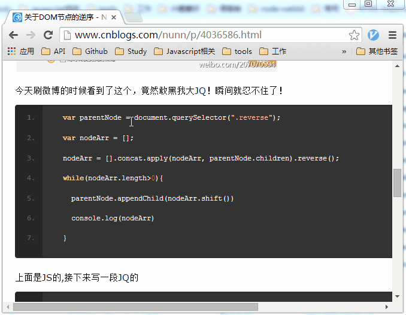
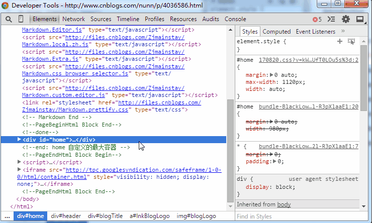
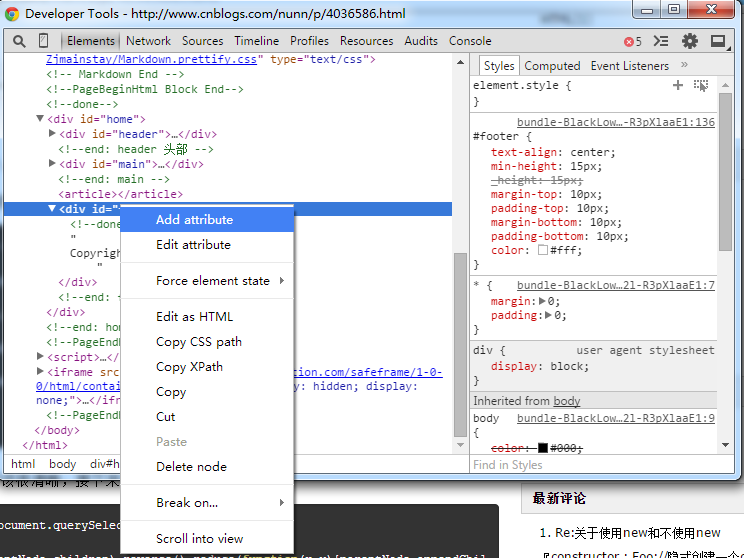
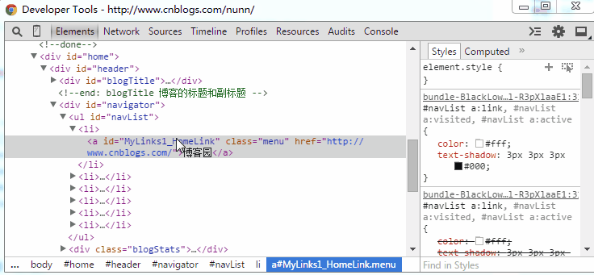
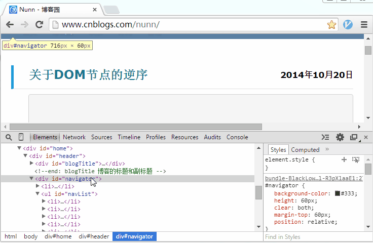
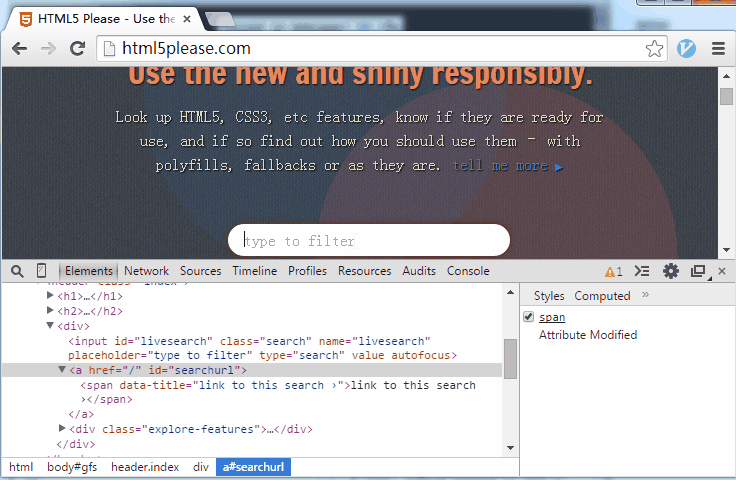
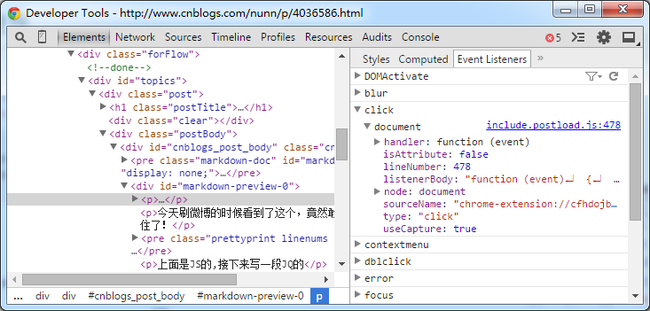
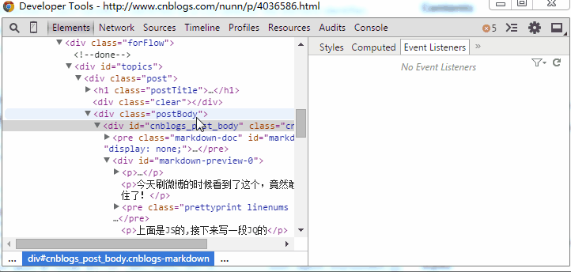

# 样式和DOM编辑器介绍

> 下面内容都是以chrome 37为标准

`Elements`面板可以让你查看当前活动页的结构信息。在当今的应用中，加载HTML文件并初始化，可能跟你最后看到的DOM树不一样。它是一个强大的可以实时表现、调试页面和制作页面的工具。

你可以使用`Elements`面板进行以下任务

- 审查页面中的`HTML`&`CSS`
- 测试不同的布局
- 在线编辑CSS

为了更好的利用屏幕空间，你可以使用下面的一些小技巧。

- *收起*你不用的标签和面板
- *规划和分配*你的DOM树和工具面板区域



## DOM

DOM树显示当前页面的DOM结构。DOM树的每个DOM节点都对应一个HTML元素，诸如`<body>`和`<p>`。为了方便阅读，DOM树视图显示HTML元素标签而不是DOM节点类型，例如`<p>`而不是`HTMLParagraphElement`。

DOM树视图在树上显示当前状态。这可能是与最初加载的HTML不配的原因之一。	

- 你可以用Javascript修改页面
- 浏览器引擎会尝试修改那些不正确的标签并产生一个意料之外的DOM树

### 审查元素

 

检查在显示的DOM节点和CSS中，对应在浏览器中渲染的元素。


这里，有若干种方法审查元素

- 在页面的任意元素右键，点击*审查元素*
- 点击`Ctrl`+ `Shift`+`C`或`Cmd`+`Shift`+`C`(mac)，开打开发者工具，进入审查模式，点击选中的元素。
- 点击*审查元素按钮*
- 在*console*中使用`inspect()`方法，比如`inspect(document.body)`，可以在[Command-Line API](https://developer.chrome.com/devtools/docs/commandline-api.md)中查看`inspect()`的使用方法



### 使用鼠标和键盘来浏览DOM

你能够通过鼠标或者键盘来操作DOM结构

- 展开一个收起的节点，双击这个节点，或者按下方向键`→`
- 收起一个展开的节点，双击这个节点，或者按下方向键`←`

展开一个节点，会再按住`→`会自动的选择第一个子节点，你可以通过反复的按住`→`来展开深度嵌套的结构



当你浏览时，`Elements`面板底部会显示的`面包屑`工具条


当前选中的节点会以蓝色高亮显示，可以点击`面包屑`来浏览


浏览上一级结构，高亮也会移动


开发人员工具尽可能的在`面包屑`中显示更多项


如果单个`项`不能够在`面包屑`工具条上面显示，那么会以`...`显示，单击`...`显示隐藏的元素。

[点击这里查看完整的键盘快捷列表](https://developer.chrome.com/devtools/docs/shortcuts.html)

### 编辑DOM节点和属性

`Elements`面板可以让你修改DOM

- 如同编辑HTML一样编辑DOM
- 添加和删除单个DOM节点
- 编辑属性和值
- 移动DOM元素

更新内存中的DOM树*不*修改源文件。重新加载会删除任意对DOM树的修改。

#### 编辑DOM节点

对于DOM节点，双击可以打开*元素标签*(`h2`, `section`, `img`)。方框内现在处于可编辑可重命名，闭合标签会自动的在修改后更新。


### 编辑属性

对于DOM属性，开发者工具区别属性的名字和值在于点击它们的位置，使它们可编辑。

- 双击属性名字编辑属性名
- 双击属性值编辑它的值部分

当编辑模式被激活，可以按*Tab*循环切换当你切换到最后一个标签，再次按下*Tab*将会创建一个新的属性。

使用*Tab*不是用来添加和编辑属性的唯一方法，因为这是一个常用的模式，也可以在DOM节点上打开内容菜单，添加和编辑属性。



- 选择*Add Attribute* 在打开的标签最后创建一个新的方框
- 选择*Edit Attribute* 修改当前的属性。这个操作会和你之前的操作相关，你可编辑的位置是你点击右键的位置。

### 如同HTML一样编辑DOM节点

如同编辑HTML一样编辑DOM节点和它的子节点

- 右键点击节点，选择*Edit as HTML*（在window下可以点击F2来切换当前节点的编辑模式）

使用可编辑的字段进行修改。

- 点击可编辑字段外更新DOM

点击`Esc`停止编辑，不修改DOM



### 移动元素

你能够在`Elements`面板改变DOM树的顺序来测试不同的布局。

在`Elements`面板拖动节点移动到DOM树上一个新的位置。


### 删除元素

删除元素节点有下面几种方法

- 右键单击节点选择`Delete Node`
- 选择节点并按下*Delete*

你也可以使用*Edit as HTML*删除这个标签内的内容

如果你不小心删除了节点，可以使用`Ctrl`+`Z`(或者`Cmd`+`Z` mac)来撤销你的最后一次行为

### 滚动到视图

当你鼠标悬停或选中节点的时候，选中的元素会在浏览器中高亮显示。如果该元素在屏幕之外，工具条会有一个小提示，所选中的元素不在显示区中。

滚动页面直到元素显示在可视区，*右键*元素选择*Scroll into View*



## 设置DOM断点

DOM断点是一个类似`Sources`面板中的断点。它被用来暂停在一定条件下正在执行中的Javascript。一个Javascript断点跟一个指定的Javascript文件的行相关联，当执行到这一行的时候被触发。DOM断点跟一个指定的DOM元素相关，当DOM元素被一些方法修改的时候被触发。

当你不知道哪个部分的Javascript更新一个给定的元素，你可以使用DOM断点来调试复杂的Javascript应用。

举个例子，如果你的Javascript改变一个DOM元素的样式，你可以在元素的属性被修改的时候设置一个DOM断点。


#### 子树修改

当一个子元素被添加，删除或者移动的时候，可以触发一个子树修改断点，如果你设置了一个子树修改断点在`main-content`元素上，触发代码如下：
```
var element = document.getElementById('main-content');
//修改这个元素的子树
var mySpan = document.createElement('span');
element.appendChild(myspan);
```

#### 属性修改

当元素的属性(`class`,`id`,`name`)动态改变的时候触发属性修改。

```
var element = document.getElementById('main-content');
//修改元素的class属性
element.className = 'active';
```

#### 节点删除

标记的节点从DOM树被删除的时候触发。

```
document.getElementById('main-content').remove();
```

上图的过程，是按照以下步骤

- 修改文本框内容，当内容不为空的时候，A标签添加一个`class="active"`
- 在A标签上添加属性修改断点
- 在执行A标签属性修改代码的时候，触发属性修改断点，并跳转到相关代码
- 鼠标悬停在Javascript的可用变量的时候，显示更多详细信息。

`Elements`和`Sources`面板都含有管理DOM断点的窗口。

所有的DOM断点，可以点击右侧的面板(如果右边窗口太窄了， 会收起来，可以点击右上角的双箭头打开)，每个断点都会带有标示符和断点类型，以列表的形式在面板中显示。


你可以在每个断点的列表项上这样做：

- *鼠标悬停*在元素标识符上，在页面中显示元素的所在位置
- *单击*元素跳转到本地的`Elements`面板
- *切换多选框*启用或停用这个断点

当DOM断点被触发的时候，这个断点会在DOM断点面板高亮显示。`Call Stack`面板会显示调试暂停的原因。


## 查看元素事件监听器

在`Event Listeners`面板查看与DOM节点相关的Javascript事件监听器



`Event Listeners`面板的顶级项显示注册侦听器的事件类型。



点击事件类型扩展箭头能看到注册事件的的处理程序列表。
每个处理程序通过类似CSS选择器的方式识别元素，比如`document`、`button#call-to-action`。如果多个处理程序注册在同一个元素上，那么元素会以列表的形式重复列出。


- *handler*包含回调函数，右键点击*Show Function Definition*查看函数在哪里定义的。
- *isAttribute* 如果这个事件是通过DOM属性注册的，举个栗子`onclick`
- *lineNumber*注册事件的行号
- *listenerBody* 字符串表示的回调函数
- *node* 注册侦听器所在的DOM节点。鼠标悬停在DOM上可以在页面中显示它
- *sourceName* 包含事件侦听器的URL路径
- *type* 事件类型
- *useCapture* 布尔值，代表addEventListener 上的`useCapture`是否设置

默认情况下，已注册的事件处理程序会以以下类型显示：

- 当前选中元素
- 当前选中元素的祖先

如果找到过多的事件处理程序，可以选点击筛选进行删选，选择`Selected Node Only`只显示当前节点的事件处理程序。


> 很多谷歌扩展程序添加了它们自定义的事件在DOM上

如果你看到一个事件侦听器但是在你的代码中找不到，你可以在匿名窗口中打开你的页面。匿名窗口默认阻止扩展程序运行。

## 样式*Style*

CSS定义页面的表示层。你可以看到和修改任意的CSS声明来控制它们在页面的显示。理解层叠样式表和继承，能够帮助开发和调试的流程。(这一句确实不知道该如何翻译了，希望英语大牛帮翻译。)
> An understanding of the cascade (in Cascading Style Sheets) and inheritance aids a development and debugging workflow

- *级联*(层叠样式表)关系到CSS声明在它们与其他规则重叠的时候如何考虑权重来确定哪些规则该优先考虑
- *继承* HTML元素如何从包含的它元素（祖先节点）里继承CSS属性

查看更多的*级联*和*继承*的相关信息，[点击这里查看W3C文档](http://www.w3.org/TR/CSS2/cascade.html)

### 样式面板

样式面板用来显示被选择元素的CSS规则，按照优先级从高到低的顺序：

- * 元素样式直接应用于使用样式属性的元素（或在 DevTools 中应用）
- * 显示的 CSS 规则是所匹配的元素的所有规则，如：CSS 中的 span 选择器匹配 HTML 中的 <span> 元素
- * 继承的样式包括所选元素的祖先元素的所有可继承样式规则


