## Debugging JavaScript

由于 JavaScript 应用程序的复杂性的增加，开发者需要高效的 JavaScript 调试工具来快速发现问题出现的原因并有效地解决它。 Chrome Devtools 包含很多有用的工具，这些工具可以帮助减少调试 JavaScript 的痛苦。

在这一部分，我们将通过调试 [Google Closure hovercard demo](https://rawgit.com/google/closure-library/master/closure/goog/demos/hovercard.html) 和其他例子来演示如何使用这些工具。

>注意：如果你是一位 web 开发人员，并且希望获取最新的 Devtools 你可以使用[Chrome Canary](https://www.google.com/intl/en/chrome/browser/canary.html)

#### Sources 面板

Sources 面板允许你调试你的 JavaScript 代码，它提供了一个图形界面的 V8 调试器，根据下面的步骤来探索 Sources 面板：

- 打开一个网站，比如[Google Closure hovercard demo](https://rawgit.com/google/closure-library/master/closure/goog/demos/hovercard.html)或[TodoMVC](http://todomvc.com/examples/angularjs/#/) Angular app
- 打开 Devtools 窗口
- 选择 Sources


Sources 面板显示当前页面的所有 scripts，面板的图标提供了控制暂停、恢复和跟踪代码，源都是可见的，都是单独的标签，点击可以打开文件浏览，通过文件了浏览可以查看所有打开的脚本。

#### 控制执行

控制执行的按钮都在面板的上面，这些按钮可以让你分部操作你的代码，可用的按钮有：

Continue：继续执行代码，直到执行到下一个断点

Step over：但不执行代码，可以看见每一行是如何影响变量的，如果你的代码中调用了另一个函数，调试器将不会进入它的代码，而是仍然执行当前函数。

 Step into：与 setp over 相似，然而，在函数调用中点击 Step into 将会导致调试器移动至其执行的第一行。

 Step out：当已经进入一个函数时，点击此按钮将会导致函数定义的其余部分将运行并跳转至执行其父级函数的功能。

Toggle breakpoints：切换断点的开启/关闭同时保证它们的启用状态完好。

Sources 面板还有一些快捷键操作：

- Continue：`F8` 或 `Ctrl` + `\` 或 Mac : `Cmd` + `\`
- Step over：`F10` 或 `Ctrl` + `'` 或 Mac : `Cmd` + `'`
- Step into：`F11` 或 `Ctrl` + `;` 或 Mac : `Cmd` + `;`
- Step out：`Shift` + `F11` 或 `Shift` + `Ctrl` + `;` 或 Mac : `Shift` + `Cmd` + `;`
- Next call frame：`Ctrl` + `.`
- Previous call frame：`Ctrl` + `,`

#### 调试断点

一个断点是在脚本中人为的停止或暂停的地方，在 Devtools 中使用断点来调试 JavaScript 代码、更新 DOM 还有网络通信。

#### 增加和删除断点

在 Sources 面板中，打开一个 JavaScript 文件来调试，下面的例子中我们打开了 Angular 的 TodoMVC 中的 todoCtrl.js 文件。

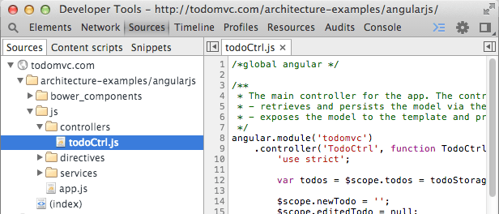

点击行号可以在此行设置断点，带有蓝色标签的行号表示已经在此行设置断点。


你可以通过点击行号来设置多个断点，每个设置断点的地方，此行右边会有一个蓝色标签。

断点可以像复选框一样启用和禁用，一个断点被禁用，蓝色的标签也会消失。

点击断点入口可以跳转到源文件中的此断点行号。

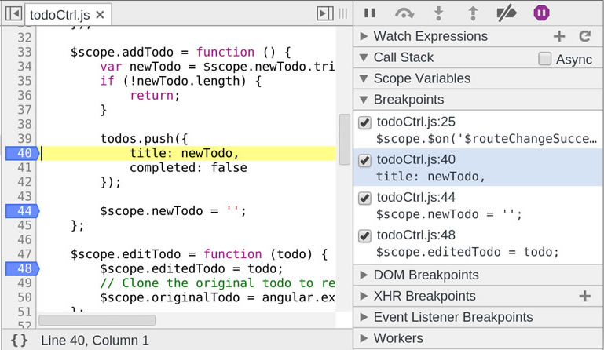

右击蓝色标签会显示一个菜单，此菜单包含以下选项：Continue to Here, Remove Breakpoint, Edit Breakpoint, and Disable Breakpoint。

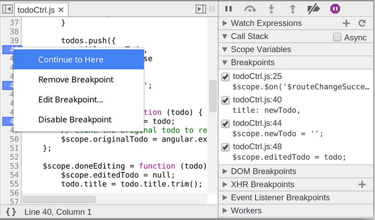

选择 Edit Breakpoint 可以设置条件断点，另外，右击行号，选择 Add Conditional Breakpoint，输入可解析为真或假的表达式，当条件为真是断点将暂停执行代码。


当你想分析一段在循环里或事件回调频繁中的代码时，条件断点非常有用。

#### 使用暂停断点

完成设置一个或多个断点之后，返回浏览器窗口页面，下面的例子中在 removeTodo() 方法中增加了一个断点，现在每次在删除 todo 项目的时候都会触发断点的暂停：


想要继续执行代码，就需要在 Devtools 窗口单击继续按钮或使用键盘的 `F8` 快捷键。

虽然脚本暂停了，你仍然可以使用右侧的 Watch、Call Stack、Scope来进行交互。

<strong>Call Stack 面板</strong>

Call Stack 面板显示导致代码暂停的完整的执行路径，给我们提示出造成错误的代码缺陷。

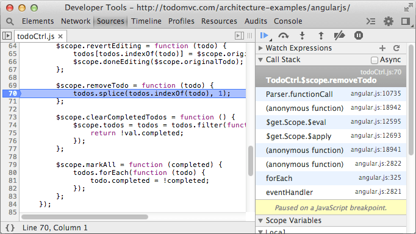

勾选 Async 可以查看包含异步 JavaScript 回调函数（如：定时器、XHR 事件）的完整路径


#### JavaScript 黑盒

当你黑盒一个 JavaScript 源文件时，在你调试代码时就不会跳转进这个源文件，只会调试你自己选择调试的代码。


你可以在设置面板中设置黑盒脚本，或者在 sources 面板中右键点击文件内容然后选择 Blackbox Script。


查看更多黑盒相关，可以访问 goole 官方文档 [Blackboxing JavaScript files](https://developer.chrome.com/devtools/docs/blackboxing)

#### Console drawer

Console drawer 可以让你在当前调试暂停时的 Scope 中做测试，按键盘的 `Esc` 键可以打开或关闭此面板。

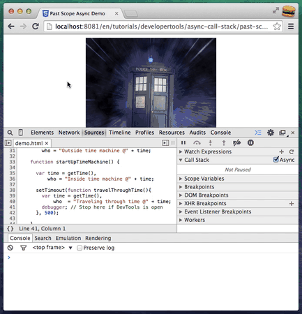

#### 动态 JavaScript 中的断点

- 
-
-
-
-

#### 在下一步 JavaScript 暂停

- 点击暂停按钮 ]
- 鼠标离开当前区域
- 你将会在 onMouseOver 函数处暂停
- 点击继续按钮或键盘 `F8` 继续执行


#### 在异常处暂停

- 点击面板里的 Pause on exceptions 按钮 可以进入异常处暂停模式
- 选中 Pause On Caught Exceptions 复选框
- 运行代码，调试工具会在抛出和捕获异常函数的位置停止运行
- 点击继续按钮 或 `F8` 来继续执行代码

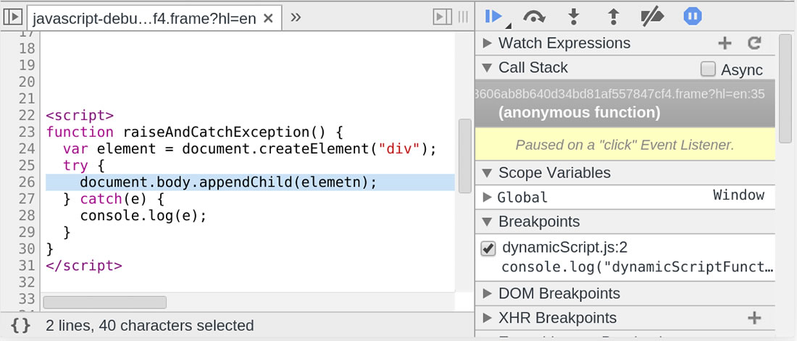

#### 在未捕获的异常处暂停

- 点击面板里的 Pause on exceptions 按钮 
- 取消对Pause On Caught Exceptions 复选框的选中
- 现在执行代码的时候不会再在捕获异常处暂停
- 会在抛出异常函数的位置停止
- 点击继续按钮 或 `F8` 来继续执行代码

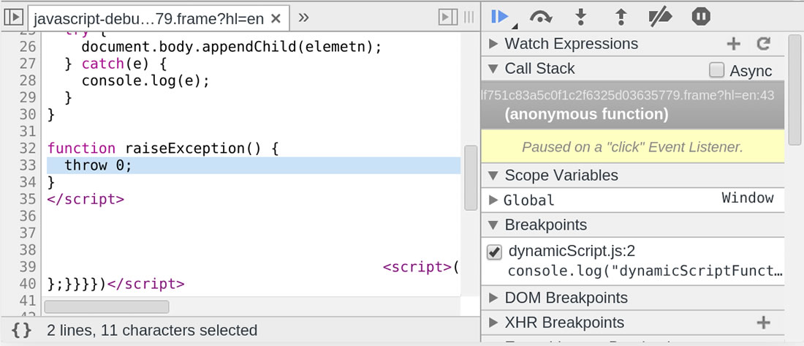

#### DOM 变化事件的断点

- 定义一个在父节点添加节点的函数
- 在浏览器窗口右击需要插入节点的父节点，选择 "审查元素"（英文版是 "Inspect Element"）
- 在 Elements 面板右击，选择 Break on Subtree Modifications
- 调用函数
- 调试工具会在父节点的 appendChild 函数处暂停
- 点击继续按钮 或 `F8` 来继续执行代码

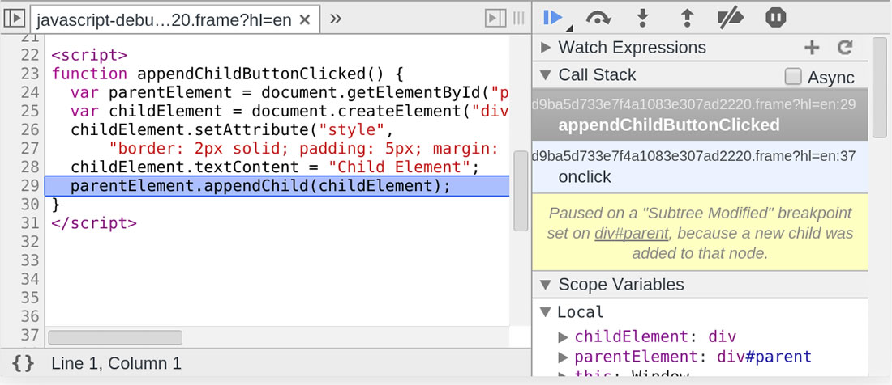

#### XHR 事件断点

- 点击 Sources 面板右侧的 XHR Breakpoints 处 按钮
- 输入一个 "data.txt" 然后回车
- 运行下面代码
```js
function retrieveData() {
  var request = new XMLHttpRequest();
  request.open('GET','javascript-debugging/data.txt', true);
  request.send();
}
```
- 代码运行会在 send 方法触发时暂停
- 在刚才新建的断点处右击，选择 Remove Breakpoint
- 点击继续按钮 或 `F8` 来继续执行代码

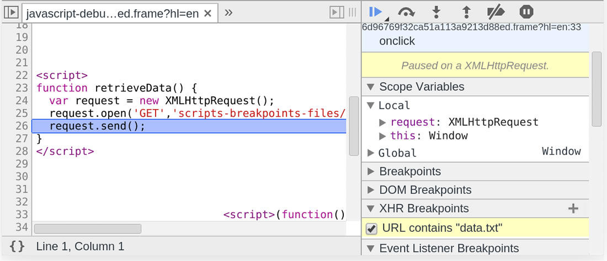

>注意：想要编辑 URL 过滤可以直接双击侧边栏中 XHR Breakpoints 下的断点，如果一个 URL 过滤内容为空，那么代表对所有 XHR 过滤。

#### JavaScript 事件监听的断点

- 展开右侧 Event Listener Breakpoints 栏
- 展开 Mouse 栏
- 点击下面的 mouseout 复选框来设置 mouseout 事件监听断点

- 定义一个元素的 mouseout 事件并在浏览器移动鼠标触发
- 调试会在 mouseout 事件处理函数的地方暂停
- 点击继续按钮 或 `F8` 来继续执行代码


> 调试工具支持以下事件：
> <strong>Keyboard：</strong>keydown, keypress, keyup, textInput

> <strong>Mouse:</strong> click, dblclick, mousedown, mouseup, mouseover, mousemove, mouseout, mousewheel

> <strong>控制：</strong>resize, scroll, zoom, focus, blur, select, change, submit, reset

> <strong>剪贴板：</strong>copy, cut, paste, beforecopy, beforecut, beforepaste

> <strong>Load：</strong> load, unload, abort, error

> <strong>DOM 更改：</strong>DOMActivate, DOMFocusIn, DOMFocusOut, DOMAttrModified, DOMCharacterDataModified, DOMNodeInserted, DOMNodeInsertedIntoDocument, DOMNodeRemoved, DOMNodeRemovedFromDocument, DOMSubtreeModified, DOMContentLoaded

> <strong>设备：</strong>设备方向，设备运动

#### 延迟恢复

当遇到暂停时，长按恢复按钮来选择 "Resume with all pauses blocked for 500 ms" ，这样可以让所有的断点自动失效半秒时间。比如，可以使用这种方法来进入下一个循环，从而避免一个循环里的不断中断。

提示：当从 Devtools 面板刷新页面（在 Devtools 面板按 Ctrl +  R）时，所有的断点中断功能在新页面加载完成前都会失效（或者用户点击取消按钮）。当从浏览器窗口点击刷新（或者在 Devtools 面板外使用 Ctrl + R），设置的所有断点都会生效，这个方法可以应用到页面卸载过程中。


#### 实时编辑

在每个断点处，都可以通过点击编辑面板来实时编辑脚本并作出修改。

- 打开应用
- 在 Sources 面板打开 .js 文件，使用 Shift + O 来定位想要找到的函数
- 点击暂停按钮来暂停调试
- 更改函数，在最后加上一个 console.log("...")
- 点击继续来恢复执行
- 现在执行这个函数就会打印我们自己添加的内容了


此方法可以在 Devtools 内保存更改而不用离开浏览器。

#### 异常

现在来看看如何使用 Chrome Devtools 来处理异常和堆栈记录。

异常处理是回应发生意外情况的程序，这些意外情况往往是会更改你的 JavaScript 代码执行正常的工作流的程序。

> 如果你是一位 Web 开发人员，并且想要获取最新的 Devtools，你可以访问[ Chrome Canary ](https://tools.google.com/dlpage/chromesxs)

#### 跟踪异常

当遇到异常时，可以打开 Devtools 的 console（Ctrl + Shift + J / Cmd + Shift + J）查看一些 JavaScript 错误消息。每条错误信息都会有一个链接，链接到对应的文件名及行号。

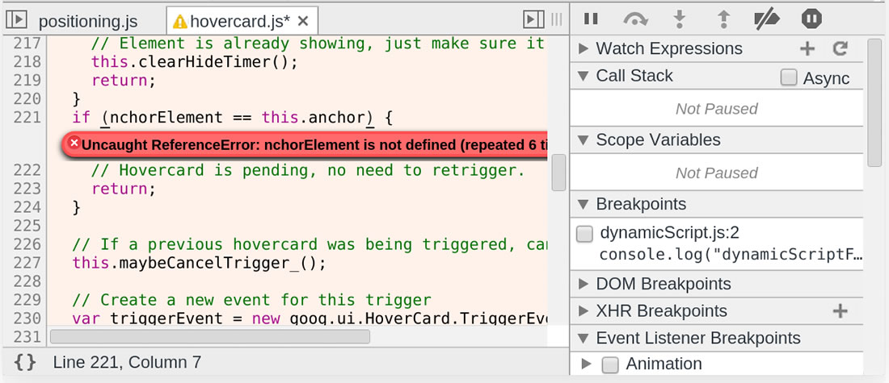

#### 查看异常堆栈记录

当错误信息的提示有多个的时候，总是不能明显的看出到底是出现了什么错误。当打开 Devtools 窗口，console 会显示完整的 JavaScript 调用堆栈信息，你还可以展开这些消息来查看这些栈信息并导航到代码中相应的位置。


#### JavaScript 异常暂停

当需要在下一次抛出异常时暂停并检查调用栈、Scope 变量和应用程序状态时，可以选择按钮来对不同的异常处理模式进行操作：你可以选择在所有异常处暂停或仅在为捕获的异常处暂停，当让也能完全忽略异常。


#### 打印堆栈记录

在 Devtools console 中打印异常日志对于了解应用程序的状态非常有用，你可以通过包含有关联的堆栈记录来让日志输出更多的信息，主要有下面几种做法：

<strong>Error.stack</strong>

每一个错误对象都有一个包含堆栈信息的字符串属性 stack：

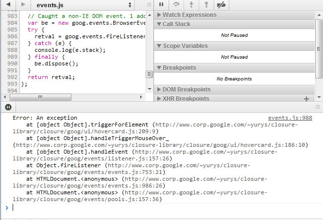

<strong>console.trace()</strong>

你可以在代码中调用 console.trace() 方法来打印当前 JavaScript 调用堆栈：


<strong>console.assert()</strong>

还有一个方法可以把断言放在你的 JavaScript 代码中，只需要调用 console.assert() 并且把错误条件当做第一个参数，每当此表达式的值为 false 时，都可以在 console 中看到相应的记录。


#### 运行时使用 window.onerror 处理异常

Chrom 支持对 window.onerror 定义处理函数，每当一个 JavaScript 异常没有被任何 try/catch 模块捕获时，此函数会被调用，参数包含异常信息、抛出异常的文件的 URL、抛出异常代码所在的行号。这样就可以很方便的设置一个错误处理程序，收集捕获的异常信息并提交服务器。


#### Pretty Print

在 Devtools 中也可以解决阅读压缩代码的不便：


在面板的左下角有一个 ,点击之后可以将压缩的代码转换为一个更可读形式。这样调试和设置断点就方便了。


#### Source Maps

对于保持客户端代码的可读性和调试合并压缩后的代码，source maps 是非常有用的：

source map 是建立源文件及压缩后文件关系的一个 JSON 格式的文件。

下面是一个简单的 source map：
```js
{
    version : 3,
    file: "out.min.js",
    sourceRoot : "",
    sources: ["foo.js", "bar.js"],
    names: ["src", "maps", "are", "fun"],
    mappings: "AAgBC,SAAQ,CAAEA"
}
```
只要思想就是，在压缩和合并你的 JavaScript 代码的时候，生成一个 source map 来保持源文件和压缩文件的关系。source map 会让 Devtools 加载除了压缩的那些文件之外的原始文件，然后就可以使用源文件来设置断点和跟踪代码了，同时，Chrome 时间运行的还是压缩后的代码，这样就可以把线上环境的代码模拟成开发环境来调试了。

<strong>使用 source map</strong>

使用正确的压缩工具

你需要使用一个能够生成 source map 的压缩工具，Closure Compiler 和 UglifyJS 2.0 就是这样的工具，当然还有一些能够为 CoffeeScript 、SASS 以及其他文件生成 source map 的工具，了解详情可以查看 [Source maps: languages, tools and other info](https://github.com/ryanseddon/source-map/wiki/Source-maps:-languages,-tools-and-other-info)

配置 Devtools

source map 默认是不可用的，但如果想要仔细查看或启用它们，首先打开 Devtools，点击设置按钮,在 sources 下选择  Enable JavaScript source maps，也有一些其他的 source map 的功能。

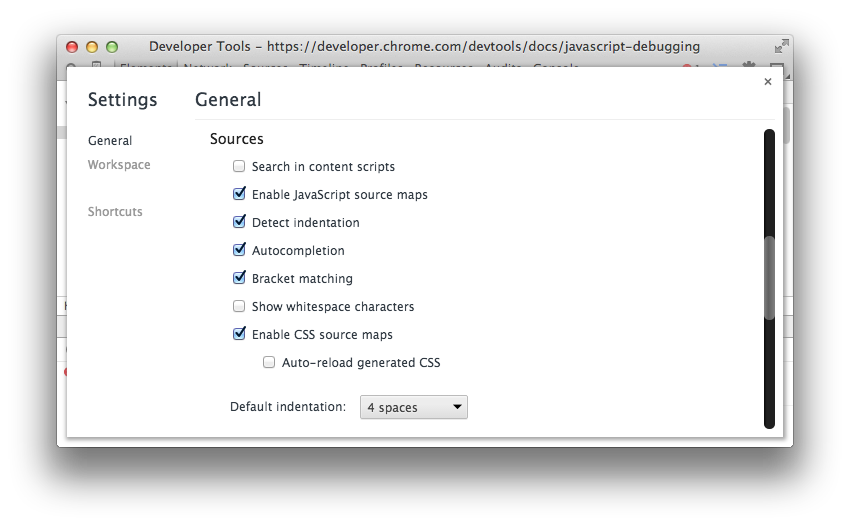

<strong>让 source map 易用</strong>

在压缩文件末尾加上下面一条注释，这样就可以告诉 Devtools 一个 source map 可用

```js
//# sourceMappingURL=/path/to/file.js.map
```

这条注释一般在压缩工具压缩文件的时候就会生成，在 CSS 文件中，注释是这样的<span style="color:#080;"> /*# sourceMappingURL=style.css.map */</span>

如果不想在压缩文件中加入注释，可以通过压缩后 JavaScript 文件的 HTTP header 来告诉 Devtools 在哪里可以找到 source map，这当然还需要配置你的 Web 服务器。

<p style="color:#080;">X-SourceMap: /path/to/file.js.map</p>

与单行注释一样，这个 header 也会遇到不支持单行注释引用 source map 的问题。你还应该验证你的 Web 服务器配置为提供 source map。比如 Google App Engine，要求对每个类型的文件有明确的配置，在这种情况下，你的 source map 文件应该使用 application/json 类型的 MIME type 来传输，而 Chrome 实际是会接收任何内容类型的，比如 application/octet-stream。

#### @sourceURL 和 DisplayName 的应用

然而，除了 source map 规定的部分，下面使用 eval 的方法可以让开发更简单。

这个方法看起来与 <span style="color:#080;">  //# sourceMappingURL</span> 很相似，实际上在 source map V3 也有提及。在你的代码中加入下面的注释，这段注释将会被赋值，你可以给这些值、行内脚本、样式命名，让名字看起来更符合逻辑。

<p style="color:#080;">//# sourceURL=source.coffee</p>

<strong>使用 sourceURL</strong>

- 打开 [demo](http://www.thecssninja.com/demo/source_mapping/compile.html)
- 打开 Devtools 中的 Sources 面板
- 输入一个文件名到 input 中
- 点击 compile 按钮
- 会弹出一个包含对 CoffeeScript source 计算值的警告框
- 现在展开 Source 面板，你会发现有一个新文件，文件名为刚才输入的文件名，双击打开之后，会看到一个对 JavaScript 源文件解析完成的文件，调试抽象语言时，之歌方式会有很大的帮助。

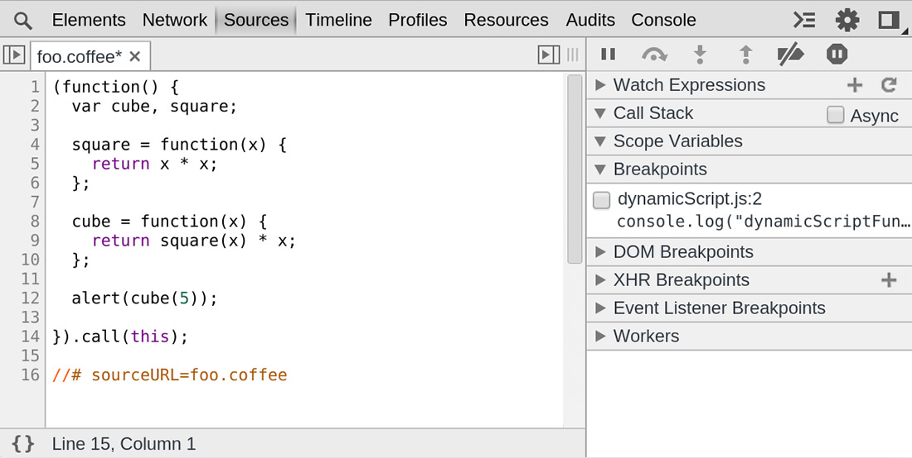

#### 了解更多

- [Breakpoint actions in JavaScript](http://www.randomthink.net/blog/2012/11/breakpoint-actions-in-javascript/)
- [The Breakpoint: Source maps spectacular](https://www.youtube.com/watch?feature=player_embedded&v=HijZNR6kc9A)
- [HTML5 Rocks: An Introduction To JavaScript Source maps](http://www.html5rocks.com/en/tutorials/developertools/sourcemaps/)
- [NetTuts: Source Maps 101](http://code.tutsplus.com/tutorials/source-maps-101--net-29173)
- [Source maps: languages, tools and other info](https://github.com/ryanseddon/source-map/wiki/Source-maps%3A-languages%2C-tools-and-other-info)
- [CSS Ninja: Multi-level Source maps](http://www.thecssninja.com/javascript/multi-level-sourcemaps)
- [Source maps for CoffeeScript](http://www.coffeescriptlove.com/2012/04/source-maps-for-coffeescript.html)