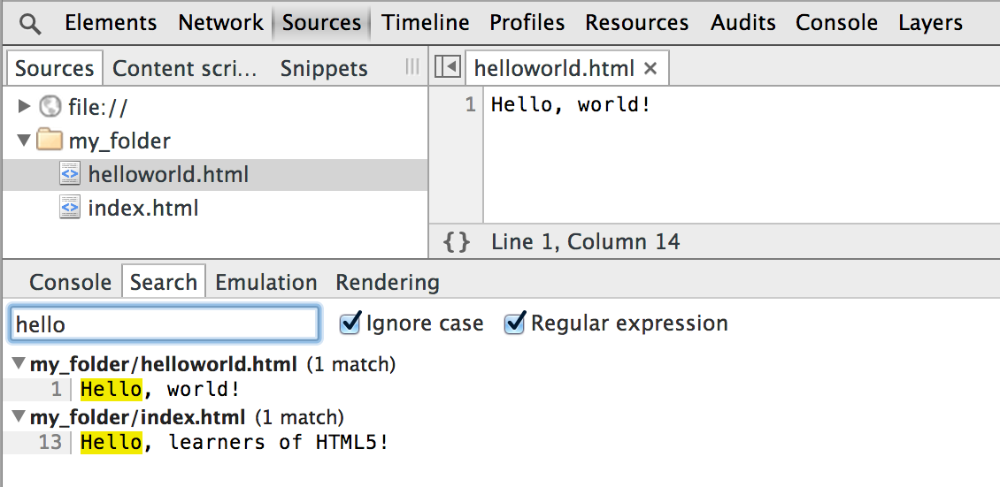

## Workspaces - 在 Devtools 中持续编辑

#### 简介

Chrome Devtools 可以让你更改网页或 CSS 的属性，并立即查看页面的变化。但是如何把这些编辑内容保存到外部编辑器中呢？Workspaces 就可以让你在不需要离开  Chrome DevTools 的情况下把在 Chrome 中编辑的内容保存到磁盘中。

在 Workspace 中，你可以编辑 Source 面板中任何类型的源文件并将这些更改保存到磁盘。你可以把本地服务器磁盘中的文件映射到服务资源，这样你就可以更改和保存这些文件了。不仅如此，如果你的映射位置设置正确， Elements 面板的样式更改也将自动保存到本地。

#### 把你的项目放进 Workspaces

在 Sources 面板的左边栏中右击鼠标，选择 Add Folder to Workspace 可以把本地文件夹中的资源添加到工作区，这样就可以在 Sources 面板中进行编辑了。选择之后会弹出一个文件对话框，你可以选择一个文件夹来添加到工作区。（不会添加当前高亮的文件夹到工作区）

当浏览器顶端出现 Devtools 请求获得文件夹的完整访问权限时，选择“允许”。

现在你就可以在 Chrome 中编辑此文件夹或其子文件夹中的源文件了。“源文件”现在并不只限于 HTML、CSS 和 Javascript，也可以是任何文件，包括 markdown 和 JSON。

#### 映射网络资源

Workspace 的真正作用在于能够将本地文件映射到一个 URL （或“Network Resource”）。每次浏览器加载映射的 URL 时，都会把网络资源中的文件夹内容显示到工作区中，这样，就算它是网络服务其中的文件，也能够使用 Devtools 对其作出更改并保存到本地文件。

把你的网站映射到本地工作区文件夹：

1. 在 Sources 面板中找到网站中的文件，右击鼠标或使用 Ctrl + 单击
2. 选择 Map to File System Resource
3. 从列表中选择相应的文件（你可能需要输入文件名或关键字来找到所需文件）
4. 在 Chrome 中刷新页面

Sources 面板中现在显示的就是你本地工作区中的文件夹内容了，不是本地主机的资源。

你也可以使用其他方式来实现，可以映射工作区到一个 URL。需要注意的是，不是所有从本地文件映射的网络资源都能加载到浏览器，但是你每个本地文件都需要映射到一个 URL。映射工作区的一个文件时，需要映射大部分网站到此工作区。

#### 注意事项

Workspace 虽然简化了你的工作流程，但还有一些事需要注意的事项：

- Elements 面板中，只有样式的改变会被保存，DOM 的变化不会被保存
- 只要你的 CSS 文件与本地副本是映射关系，Elements 面板中的样式更改就会立即保存（也就是说，在 Elements 面板中的样式更改不需要手动保存）
- 如果你是从远程服务器映射文件，当你刷新页面时，浏览器会重新加载远程文，你所编辑的更改仍然保存在本地，在你继续编辑文件时会重新应用于工作区。

#### Workspace 中的文件管理

除了编辑现有文件，你还可以在工作区中新增或删除本地文件夹中的文件。

<strong>新增文件</strong>

在 Sources 面板左侧，在一个文件夹上右击，选择 New File

<strong>删除文件</strong>

在 Sources 面板左侧，选中一个文件右击鼠标，选择 Delete File。

你也可以通过选择  Duplicate File 来复制文件，新的文件会在 Sources 面板中显示，你可以重命名此文件。

<strong>刷新</strong>

现在，你可以添加或删除文件了，而且 Sources 面板也会直接显示最新文件，如果不显示这些变化，你可以在一个文件夹上右击鼠标，选择 Refresh 来强制刷新。

如果你在外部编辑器中更改文件之后，如果想在 Devtools 显示更改，这个方法是非常有用的，一般情况下 Devtools 会自动捕获你所作出的更改（包括外部编辑器），但是，如果你需要编辑一个 HTML 或 CSS 文件就需要使用这个方法了。

在工作区的多个文件中查找关键字

在 Devtools 中，通常使用 Ctrl + O（Mac：Cmd + O）可以打开一个查找文件的面板，在工作区中同样可以使用这个快捷键来查找加载到的文件以及本地文件。

还有一个方法可以在工作区的文件中查找关键字，你可以用字符串或者正则表达式来搜索，Devtools 会查找每个匹配的文件和页面。

在工作区中的多个文件中查找关键字：

1. 点击 `Esc` 打开 console 面板，点击 Search 来打开 Search 面板，或者使用 `Ctrl` + `Shift` + `F`（`Cmd` + `Shift` + `F`）快捷键调出 Search 面板
2. 在搜索框中输入关键字，按 Enter 键，如果你填写的是正则表达式或者需要不区分大小写，可以勾选相应的复选框

Workspace 是 Devtools 中新出现和正在开发的区域，想了解更多关于 Workspace 的内容，可以[点击这里](https://github.com/GoogleChrome/devtools-docs/issues/30)